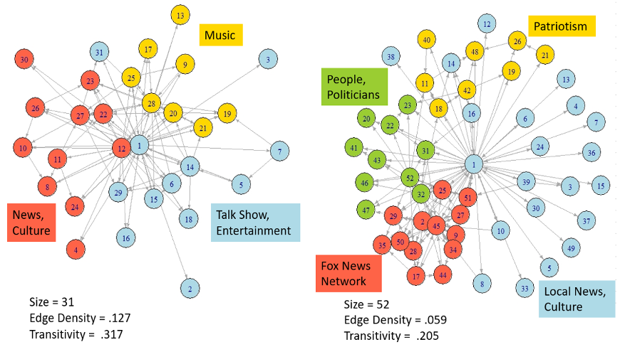
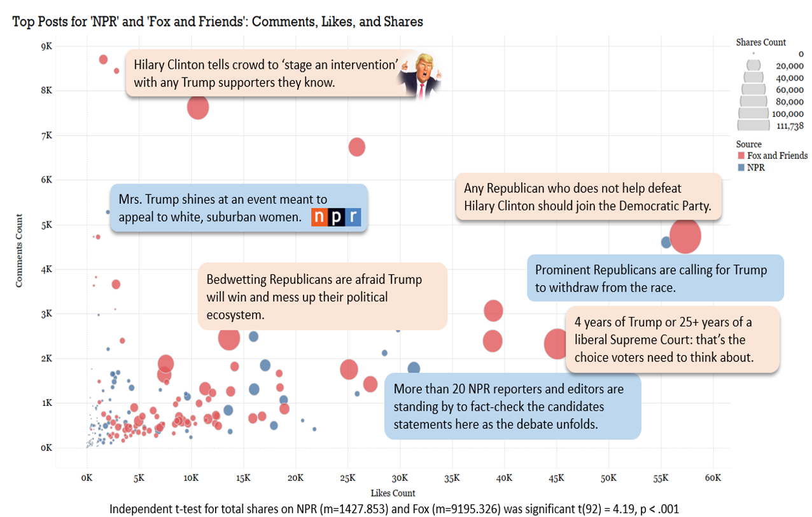
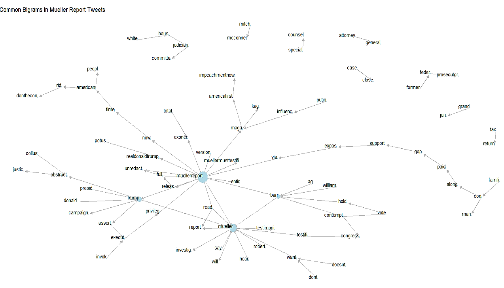

# SocialMediaAnalytics
Social Media Analytics project at BCU Big Data Analytics
This report examines political attitudes through the lens of social media. Research shows that social networks such as Facebook and Twitter are highly influential in individual political attitudes, information seeking, and voting behavior (Bond, et al., 2012). Further, it has been shown that participation on social media may lead to more polarized political ideologies (Lee, Shin, & Hong, 2018). 
This report contains two parts. The first part examined the social media presence of two rivaling news agencies during the 2016 USA Presidential Election; we extrapolate on the differing effects of Facebook behavior on political action. In the second part, various text mining techniques are utilized to understand the Mueller Report (MUER) and the reactions to its release. 

### NPR and Fox News Topic Differences 2016 Election 

### NPR and Fox News Popular Headlines 2016 Election 

### Mueller Report Headlines Network 

